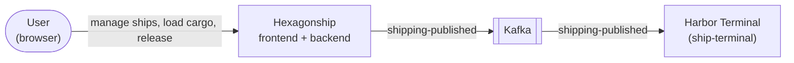

> Status: draft

# 3. Context and Scope

## Business context

| Partner | Input to Hexagonship | Output from Hexagonship |
|---|---|---|
| User | Ship data, Catain choice, Cargo to load, Release command | Ship lists, ship details, Shipping Summary, Catain Images |
| Harbor Terminal | — | `shipping-published` events (via Kafka) |

The Harbor Terminal lives in this repo but is a separate deployable and consumer; it is treated as a
neighbour that depends only on the published event.

## Technical context

| Channel | Protocol | Notes |
|---|---|---|
| Browser → frontend | HTTP, static Angular app via nginx | Ingress routes `/` to the frontend. |
| Frontend → backend | REST/JSON under `/web` (`openapi.yml`) | Ingress routes `/web` to the backend. |
| Backend → PostgreSQL | JDBC | Ships, cargo, shippings, quotes, outbox table. |
| Backend → MinIO | S3 API | Catain Images, bucket `catains`. |
| PostgreSQL → Kafka | Debezium (Kafka Connect) CDC on `shipping_outbox` | Outbox EventRouter → topic `hexagonship-shipping`. |
| Kafka → Harbor Terminal | Kafka consumer, group `ship-terminal` | JSON payload. |

## Foreign systems

All foreign systems are self-hosted infrastructure started by Docker Compose / `k8s/`; none is an
external service with its own owner.

| System | Protocol / data | Auth | Availability / outage contact | Quirks |
|---|---|---|---|---|
| PostgreSQL 13 | JDBC; all domain data + outbox | user/password (config, k8s Secret) | Self-hosted; project owner | Logical replication must be enabled for Debezium (`replica_identity.sql`). |
| MinIO | S3; Catain portrait images by image id | access key/secret | Self-hosted; project owner | Images seeded by a k8s Job (`21-minio.yaml`). |
| Kafka + Kafka Connect (Debezium 3.0) | CDC from outbox, topic `hexagonship-shipping` | none (local) | Only in `docker-compose-kafka.yml`; not in `k8s/` | A second connector streams the `catains` table with no consumer. Connectors registered by hand from `kafka-connect/connectors/`. |

> TODO: credentials are plain text in `application.yml` and connector JSON — acceptable for a playground? (see 11 / ADR candidate)
