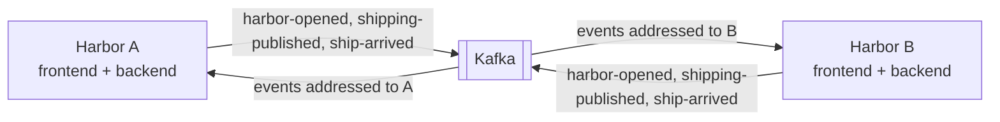

> Status: draft

# 3. Context and Scope

## Business context

| Partner | Input to Hexagonship | Output from Hexagonship |
|---|---|---|
| User | Ship data, Catain choice, Cargo to load, Release command | Ship lists, ship details, Shipping Summary, Catain Images |
| Harbor Terminal | — | `shipping-published` events (via Kafka) |

The Harbor Terminal lives in this repo but is a separate deployable and consumer; it is treated as a
neighbour that depends only on the published event.

### Several Harbors

Per [ADR-0003](../adr/0003-run-each-ship-backend-instance-as-one-harbor.md), each Hexagonship
deployment is one **Harbor**. Other Harbors are neighbours that exchange events through Kafka (built by
STORY-003 to STORY-007).

| Partner | Input to a Harbor | Output from a Harbor |
|---|---|---|
| Other Harbors | `harbor-opened`, `shipping-published` addressed to this Harbor, `ship-arrived` for ships it Released | the same three events, for the other Harbors |

`shipping-published` carries the ship's Home Harbor (`shipEventData.homeHarbor`). Decided, not built yet
(EPIC-003): it gains how many of each Cargo is aboard and the ship's Earnings
([ADR-0008](../adr/0008-carry-earnings-home-with-the-ship.md)). A
ship whose delivery is refused sails back to its Home Harbor as an ordinary `shipping-published`
([ADR-0007](../adr/0007-unload-incoming-ships-manually-after-arrival.md)). No payment event exists:
money moves between Harbors only with the ship.

## Technical context

| Channel | Protocol | Notes |
|---|---|---|
| Browser → frontend | HTTP, static Angular app via nginx | Ingress routes `/` to the frontend. |
| Frontend → backend | REST/JSON under `/web` (`openapi.yml`) | Ingress routes `/web` to the backend. |
| Backend → PostgreSQL | JDBC | Ships, cargo, shippings, quotes, outbox table. |
| Backend → MinIO | S3 API | Catain Images, bucket `catains`. |
| PostgreSQL → Kafka | Debezium (Kafka Connect) CDC on `shipping_outbox` | Outbox EventRouter → topic `hexagonship-shipping`: `shipping-published` and, since STORY-006, `ship-arrived` (both `aggregate_type` `shipping`, keyed by the Shipping id). |
| Kafka → Harbor Terminal | Kafka consumer, group `ship-terminal` | JSON payload. |
| Kafka → backend | Kafka consumer, one group per Harbor | `hexagonship-shipping` (built, STORY-006) and `hexagonship-harbor`; idempotent inbox per [ADR-0004](../adr/0004-consume-kafka-events-in-ship-backend-through-an-idempotent-inbox.md). |
| PostgreSQL → Kafka, `hexagonship-harbor` | Debezium outbox router, `aggregate_type` `harbor` | Log-compacted topic keyed by a UUIDv5 of the Harbor Name ([ADR-0005](../adr/0005-discover-harbors-via-harbor-opened-events-on-a-compacted-topic.md)). |

## Foreign systems

All foreign systems are self-hosted infrastructure started by Docker Compose / `k8s/`; none is an
external service with its own owner.

| System | Protocol / data | Auth | Availability / outage contact | Quirks |
|---|---|---|---|---|
| PostgreSQL 13 | JDBC; all domain data + outbox | user/password (config, k8s Secret) | Self-hosted; project owner | Logical replication must be enabled for Debezium (`replica_identity.sql`). |
| MinIO | S3; Catain portrait images by image id | access key/secret | Self-hosted; project owner | The k8s Job in `21-minio.yaml` and Compose only create the bucket `catains`; the images are not in the repository and were uploaded by hand, so a new Harbor has none (STORY-017). |
| Kafka + Kafka Connect (Debezium 3.0) | CDC from outbox, topic `hexagonship-shipping` | none (local) | Only in `docker-compose-kafka.yml`; not in `k8s/` | A second connector streams the `catains` table with no consumer. Connectors registered by hand from `kafka-connect/connectors/`. |

Since Harbors exchange ships ([ADR-0004](../adr/0004-consume-kafka-events-in-ship-backend-through-an-idempotent-inbox.md)),
ship-backend depends on Kafka as well, and every Harbor needs its own Debezium connector with its own
connector name and replication slot (`docs/services/ship-backend/how-to-run-two-harbors.md`).

> TODO: credentials are plain text in `application.yml` and connector JSON — acceptable for a playground? (see 11 / ADR candidate)
