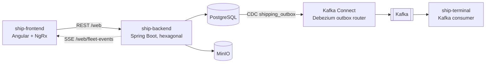
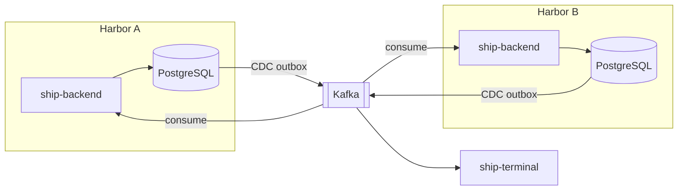
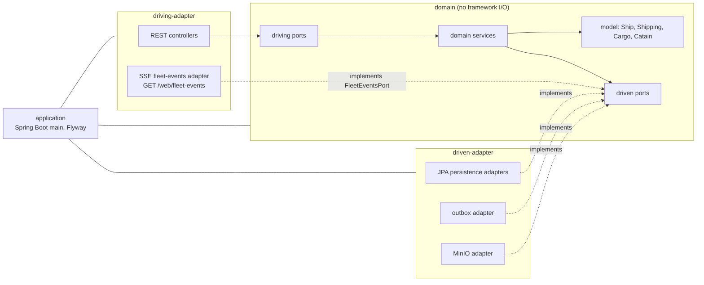

> Status: draft

# 5. Building Block View

## Level 1 — whitebox Hexagonship

| Block | Responsibility | Interface | Bounded contexts |
|---|---|---|---|
| ship-frontend | UI: ships list, create ship, cargo loading, release, Shipping Summary. State in NgRx stores (`ships`, `catains`). Decided, not built: Angular Material with the pirate theme (EPIC-002, [decision 0001](../services/ship-frontend/decisions/0001-build-the-ui-on-angular-material-with-a-pirate-theme.md)) and a harbor management page for Stock, Savings, Market and Incoming Ships (EPIC-003). | Consumes REST `/web/*` and the SSE stream `/web/fleet-events` | Fleet, CargoLoading, Shipping, Trade (UI) |
| ship-backend | All domain logic and persistence; writes the outbox; pushes fleet changes to the frontend. | REST `/web/ships`, `/web/ships/{id}/cargos`, `/web/ships/{id}/shippings`, `/web/cargos`, `/web/catains`, `/web/harbors`; SSE `/web/fleet-events` (`ship-backend/openapi.yml`). Decided, not built: the current Harbor Name (STORY-015); Stock, Savings and Market purchases; unloading and refusing Incoming Ships (EPIC-003); Ship Class and Hiring Recruits ([ADR-0009](../adr/0009-carry-crew-with-the-ship-and-fill-recruit-pools-per-harbor.md)). | Fleet, CargoLoading, Shipping, Trade |
| Kafka Connect (Debezium) | Turns outbox rows into events on `hexagonship-<aggregate_type>`. | Connector config in `kafka-connect/connectors/` | — (infrastructure) |
| ship-terminal | Prints each departed ship. | Consumes `hexagonship-shipping` | HarborTerminal |

### Harbors

Per [ADR-0003](../adr/0003-run-each-ship-backend-instance-as-one-harbor.md), the whole block set
above (frontend, backend, PostgreSQL, MinIO, Debezium connector) is deployed once per Harbor, and the
Harbors share one Kafka. ship-backend also **consumes** events
([ADR-0004](../adr/0004-consume-kafka-events-in-ship-backend-through-an-idempotent-inbox.md)).
ship-terminal stays one departure board for all Harbors.

## Level 2 — ship-backend

Module structure per [ADR-0001](../adr/0001-hexagonal-architecture-with-maven-modules.md).

| Block | Responsibility |
|---|---|
| `domain` | Model and invariants, driving ports (`*ManagementPort`, `*InformationPort`) and driven ports (`*RepositoryPort`, `ShippingOutboxRepository`, `CatainImageRemotePort`, `FleetEventsPort`). Depends only on `spring-context` and `jakarta.transaction`. |
| `driving-adapter` | Maps HTTP requests/responses to driving ports. Also holds the SSE fleet-events adapter: it implements the driven port `FleetEventsPort`, keeps the open `GET /web/fleet-events` streams and pushes `ship-arrived` / `ship-left` after commit ([ADR-0006](../adr/0006-push-fleet-changes-to-the-frontend-with-server-sent-events.md)). |
| `driven-adapter` | Implements driven ports: JPA entities and repositories, the outbox writer (`ShippingEvent` payload), the MinIO client. |
| `application` | Boot entry point, configuration, Flyway migrations (`db/migration`). |

Per [ADR-0004](../adr/0004-consume-kafka-events-in-ship-backend-through-an-idempotent-inbox.md),
`driving-adapter` holds the **Kafka listeners** (spring-kafka) that map inbound events to the driving
ports, and `driven-adapter` holds the **inbox adapter** that records consumed event ids and the store
for the Known Harbors. Stock is persisted next to the Cargo catalog. Decided, not built (EPIC-003):
Savings, Prices and a ship's Earnings and Home Harbor are persisted the same way, behind driven ports
of the Trade concepts. Decided, not built ([ADR-0009](../adr/0009-carry-crew-with-the-ship-and-fill-recruit-pools-per-harbor.md)): a ship's Ship Class and Crew are persisted with the
ship, and each Harbor's Recruit Pool next to it.

The backend has no package-level split by bounded context yet; Fleet, CargoLoading and Shipping all
share the `Ship` model (Shared Kernel in the [context map](../domain/context-map.md)).
