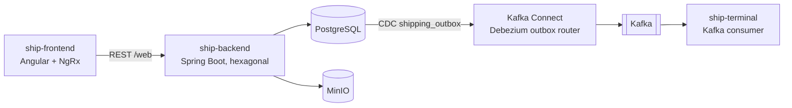
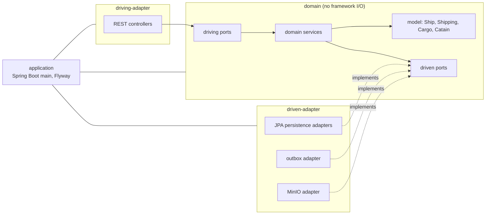

> Status: draft

# 5. Building Block View

## Level 1 — whitebox Hexagonship

| Block | Responsibility | Interface | Bounded contexts |
|---|---|---|---|
| ship-frontend | UI: ships list, create ship, cargo loading, release, Shipping Summary. State in NgRx stores (`ships`, `catains`). | Consumes REST `/web/*` | Fleet, CargoLoading, Shipping (UI) |
| ship-backend | All domain logic and persistence; writes the outbox. | REST `/web/ships`, `/web/ships/{id}/cargos`, `/web/ships/{id}/shippings`, `/web/cargos`, `/web/catains` (`ship-backend/openapi.yml`) | Fleet, CargoLoading, Shipping |
| Kafka Connect (Debezium) | Turns outbox rows into events on `hexagonship-<aggregate_type>`. | Connector config in `kafka-connect/connectors/` | — (infrastructure) |
| ship-terminal | Prints each departed ship. | Consumes `hexagonship-shipping` | HarborTerminal |

## Level 2 — ship-backend

Module structure per [ADR-0001](../adr/0001-hexagonal-architecture-with-maven-modules.md).

| Block | Responsibility |
|---|---|
| `domain` | Model and invariants, driving ports (`*ManagementPort`, `*InformationPort`) and driven ports (`*RepositoryPort`, `ShippingOutboxRepository`, `CatainImageRemotePort`). Depends only on `spring-context` and `jakarta.transaction`. |
| `driving-adapter` | Maps HTTP requests/responses to driving ports. |
| `driven-adapter` | Implements driven ports: JPA entities and repositories, the outbox writer (`ShippingEvent` payload), the MinIO client. |
| `application` | Boot entry point, configuration, Flyway migrations (`db/migration`). |

The backend has no package-level split by bounded context yet; Fleet, CargoLoading and Shipping all
share the `Ship` model (Shared Kernel in the [context map](../domain/context-map.md)).
