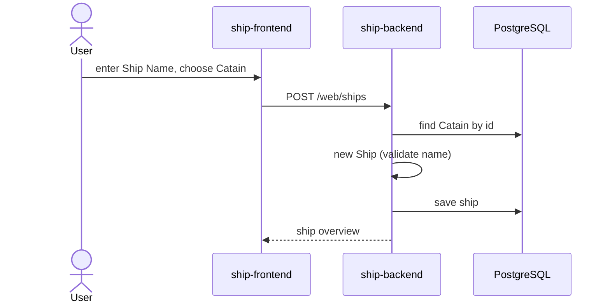
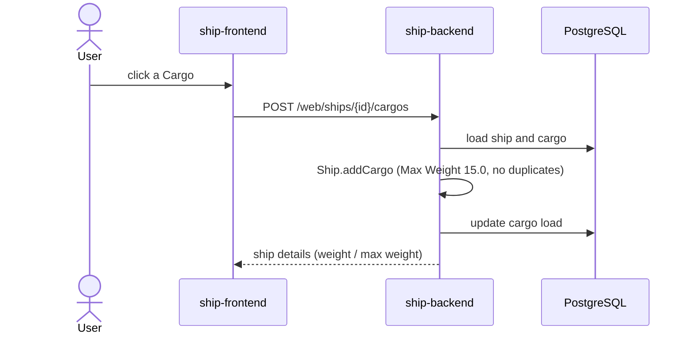
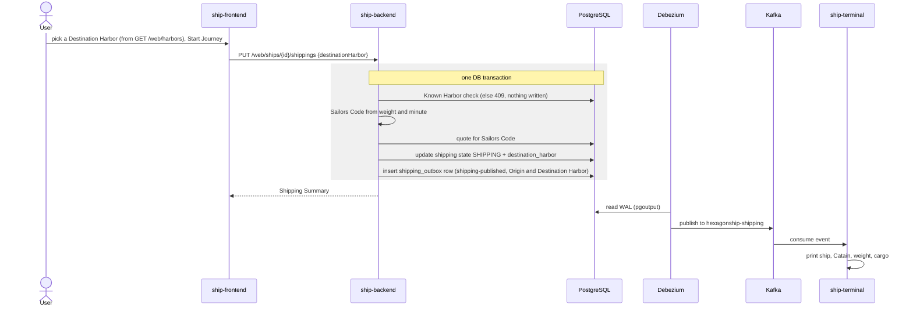
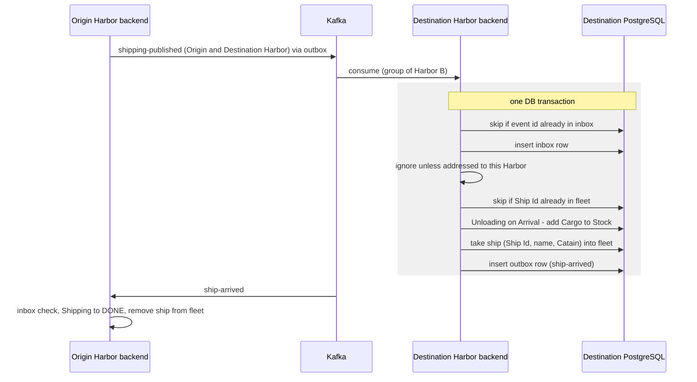
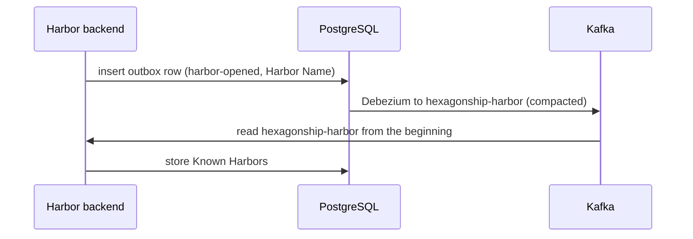

> Status: draft

# 6. Runtime View

## 6.1 Create a ship

If the Catain does not exist, creation fails (`IllegalStateException`).

## 6.2 Load cargo

A rejected load (too heavy, already loaded) returns the unchanged ship details with HTTP 200, not an error.

## 6.3 Release a shipping (transactional outbox)

Publication pattern per [ADR-0002](../adr/0002-transactional-outbox-via-debezium.md).

## 6.4 Arrival at the Destination Harbor (Destination side built)

Per [ADR-0003](../adr/0003-run-each-ship-backend-instance-as-one-harbor.md) and
[ADR-0004](../adr/0004-consume-kafka-events-in-ship-backend-through-an-idempotent-inbox.md). The
Destination side is built by STORY-006 (`ShippingEventListener` → `ArrivalManagementService`); the
Origin side (consuming `ship-arrived`) is planned for STORY-007. Besides the inbox, a ship whose Ship Id
is already in the fleet is skipped, so a re-published Release under a new event id has no effect.

## 6.5 Harbor startup and discovery (planned)

Per [ADR-0005](../adr/0005-discover-harbors-via-harbor-opened-events-on-a-compacted-topic.md). Not built yet.

A Release then offers the Known Harbors other than the current one as Destination Harbor.

> TODO: error scenarios (Debezium down, consumer offline) once the quality scenarios in chapter 10 are set.
