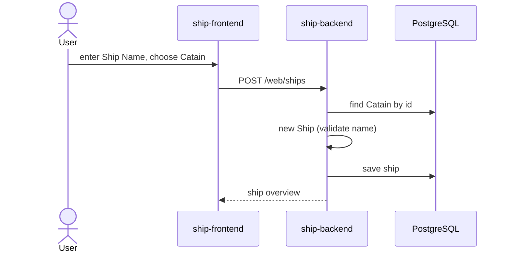
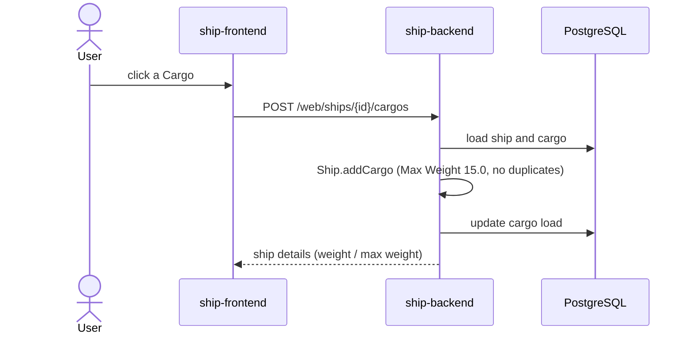
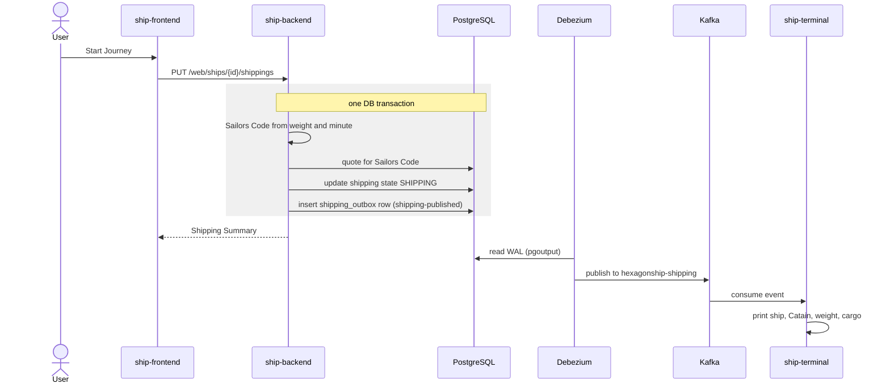

> Status: draft

# 6. Runtime View

## 6.1 Create a ship

If the Catain does not exist, creation fails (`IllegalStateException`).

## 6.2 Load cargo

A rejected load (too heavy, already loaded) returns the unchanged ship details with HTTP 200, not an error.

## 6.3 Release a shipping (transactional outbox)

Publication pattern per [ADR-0002](../adr/0002-transactional-outbox-via-debezium.md).

> TODO: error scenarios (Debezium down, consumer offline) once the quality scenarios in chapter 10 are set.
