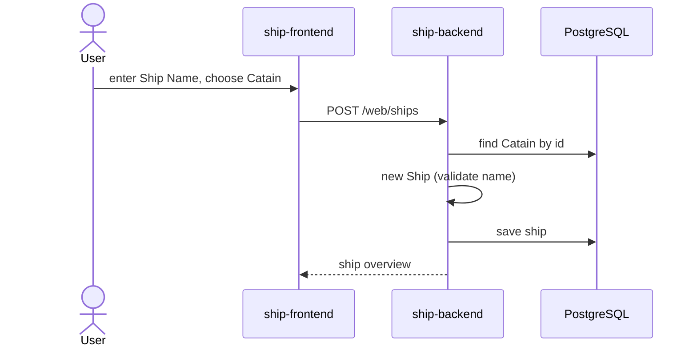
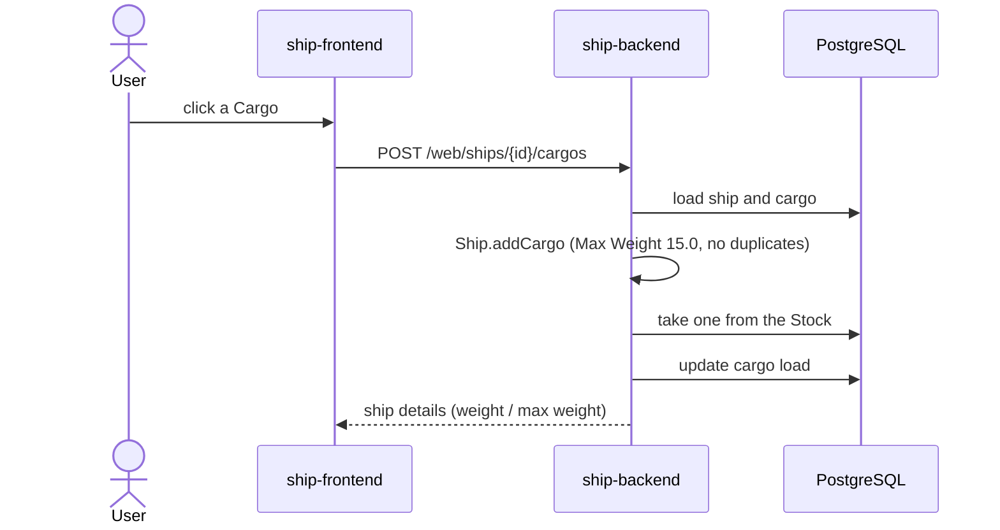
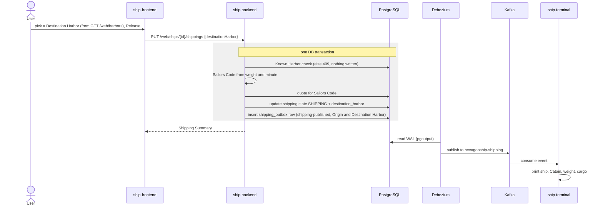
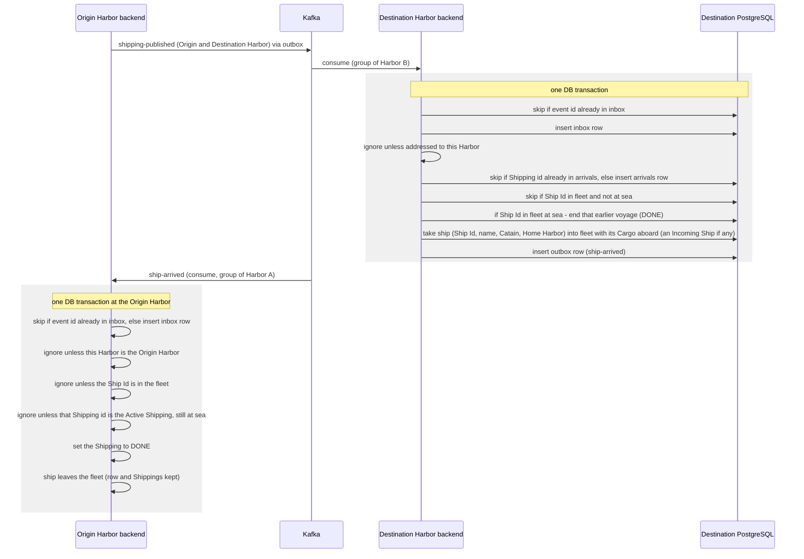
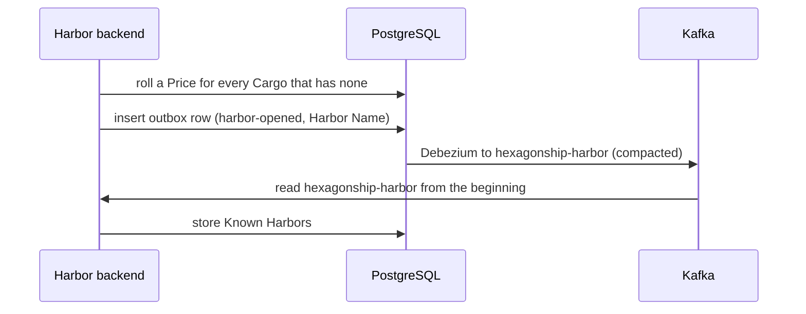
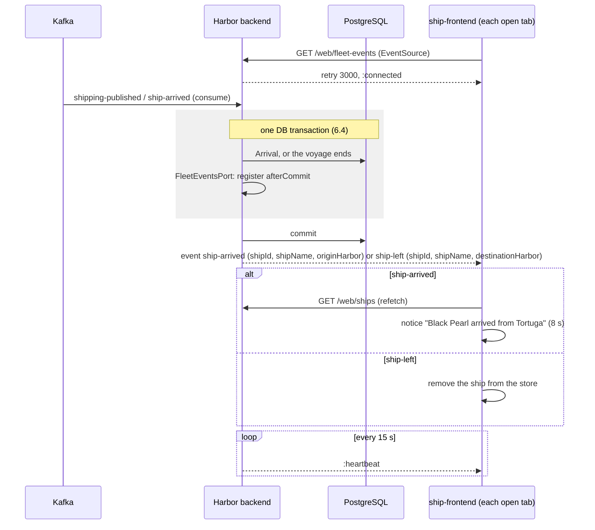
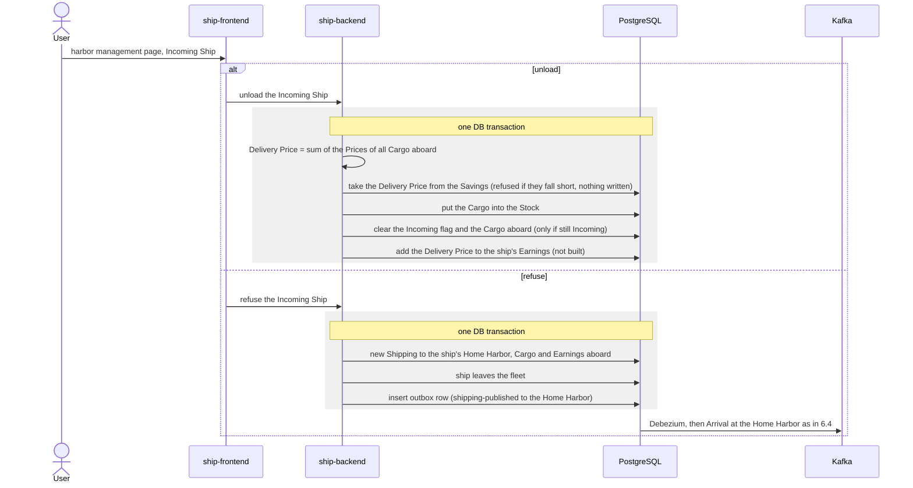
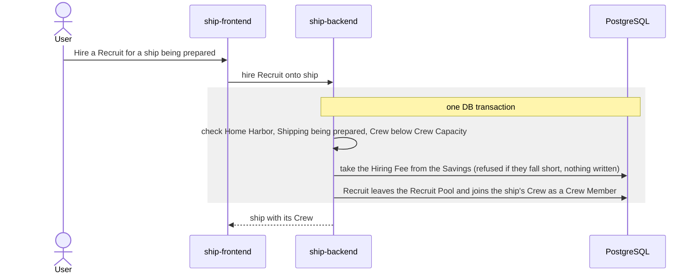

> Status: draft

# 6. Runtime View

## 6.1 Create a ship

If the Catain does not exist, creation fails (`IllegalStateException`).

## 6.2 Load cargo

A rejected load (too heavy, out of Stock) changes nothing and is answered with `409` (8.4).
The User loads Cargo by dragging it onto the ship, or with the Load button on its card. Decided, not built:
a ship may carry several of the same Cargo (STORY-022).

## 6.3 Release a shipping (transactional outbox)

Publication pattern per [ADR-0002](../adr/0002-transactional-outbox-via-debezium.md).

## 6.4 Arrival at the Destination Harbor (both sides built)

Per [ADR-0003](../adr/0003-run-each-ship-backend-instance-as-one-harbor.md) and
[ADR-0004](../adr/0004-consume-kafka-events-in-ship-backend-through-an-idempotent-inbox.md). The
Destination side is built by STORY-006 (`ShippingEventListener` → `ArrivalManagementService`), the
Origin side (consuming `ship-arrived` through the same listener) by STORY-007. Besides the inbox, the
Destination Harbor records each handled Arrival by the Origin's Shipping id (`arrivals`), so a
re-published Release under a new event id has no effect, even after the ship has sailed on and left its
fleet. On the Origin side only the ship's Active Shipping with the reported Shipping id, still at sea,
ends, so a re-published or late `ship-arrived` never ends a later voyage. The ship leaves the fleet but
keeps its row, and a later Arrival of the same Ship Id takes it back in. The arriving ship keeps the Home
Harbor carried in `shipping-published`; an event without one (from a Harbor that does not send it yet)
gives it the Origin Harbor as Home Harbor.

A return trip does not rely on order. If the returning ship's Release reaches the former Origin Harbor
before the `ship-arrived` of its earlier voyage (possible on a round trip through three or more Harbors,
R-10), the ship is still in that Harbor's fleet, at sea: the Arrival ends that earlier voyage implicitly
(`DONE`) and the ship stays in the fleet. The late `ship-arrived` then finds no voyage at sea with its
Shipping id and has no effect, so the ship is not removed. A ship in the fleet that is not at sea does not
arrive again.

Once each of these transactions commits, the Harbor pushes the change to its Users' open fleet pages
(6.6).

The Stock is unchanged by an Arrival; it changes only when a User buys at the Market (STORY-025) or unloads an
Incoming Ship (6.7, [ADR-0007](../adr/0007-unload-incoming-ships-manually-after-arrival.md), built by STORY-045). A ship that
arrives with no Cargo joins as an ordinary ship.

### Decided, not built yet: Earnings (EPIC-003)

Per [ADR-0008](../adr/0008-carry-earnings-home-with-the-ship.md), the Destination transaction changes in one
place; everything else above stays, including `ship-arrived` in the same transaction:

- If this Harbor is the ship's Home Harbor, the Earnings carried in `shipping-published` go into the
  Savings and the ship's Earnings become zero, in the same inbox transaction, so a redelivered event
  credits nothing twice.

### Decided, not built yet: the Crew sails with the ship

Per [ADR-0009](../adr/0009-carry-crew-with-the-ship-and-fill-recruit-pools-per-harbor.md), `shipping-published` (6.3) also carries the ship's Crew in full, and the Destination
transaction takes the ship into the fleet with that Crew aboard, replacing any Crew still stored for a
returning ship. The Crew never joins this Harbor's Recruit Pool. A Refused Delivery (6.7) takes the
Crew home the same way.

## 6.5 Harbor startup and discovery

Per [ADR-0005](../adr/0005-discover-harbors-via-harbor-opened-events-on-a-compacted-topic.md). Built by STORY-003; the Prices are rolled by STORY-024.

The Price rolls and the outbox row are written in one transaction: a failed roll aborts startup. A Release then offers the Known Harbors other than the current one as Destination Harbor.

## 6.6 Fleet changes pushed to the browser

Per [ADR-0006](../adr/0006-push-fleet-changes-to-the-frontend-with-server-sent-events.md). The Available
Ships page holds an `EventSource` on `GET /web/fleet-events`. When the Harbor handles an Arrival (6.4,
Destination side) or learns that a ship it Released has arrived elsewhere (6.4, Origin side),
`ArrivalManagementService` announces it through `FleetEventsPort` as the last step of its transaction. The
SSE adapter defers the push to `afterCommit`, so a rolled-back change is never pushed. An event the
Harbor ignores (a duplicate, an Arrival addressed to another Harbor, a Ship Arrived for another Origin
Harbor) changes nothing and pushes nothing.

The registry of open streams is in memory per instance (R-11). A disconnected tab reconnects by itself
after 3 s; events in between are not replayed.

The harbor management page reacts to the same `ship-arrived` event, and to every (re)connect, by
refetching its Incoming Ships (`GET /web/incoming-ships`, STORY-044).

## 6.7 Unload or refuse an Incoming Ship (unload built, refuse decided)

Per [ADR-0007](../adr/0007-unload-incoming-ships-manually-after-arrival.md) and
[ADR-0008](../adr/0008-carry-earnings-home-with-the-ship.md) (EPIC-003, STORY-026 to STORY-029). Both
are REST-driven, each in one DB transaction at the Destination Harbor. Unloading is built by STORY-045
(`POST /web/incoming-ships/{id}/unloading`) without the Earnings step: it pays, stocks, and then clears
the ship with a conditional update, so of two concurrent unloadings of the same ship the second fails and
rolls its payment back. Refusing and the Earnings are decided, not built.

At its Home Harbor an unloaded ship's Earnings go into the Savings at once. A ship its own Home
Harbor refuses does not sail: it stays in the fleet as an ordinary ship with its Cargo aboard,
nothing is paid, and that Cargo cannot be unloaded into the Stock while preparing (R-12, STORY-028).

## 6.8 Hire a Recruit (decided, not built yet)

Per [ADR-0009](../adr/0009-carry-crew-with-the-ship-and-fill-recruit-pools-per-harbor.md). REST-driven, in one DB transaction at the ship's Home Harbor. The Recruit Pool is this
Harbor's own; how it is filled is left to the stories.

Nothing is published: the Crew leaves the Harbor only with the ship, in `shipping-published`.

> TODO: error scenarios (Debezium down, consumer offline) once the quality scenarios in chapter 10 are set.
