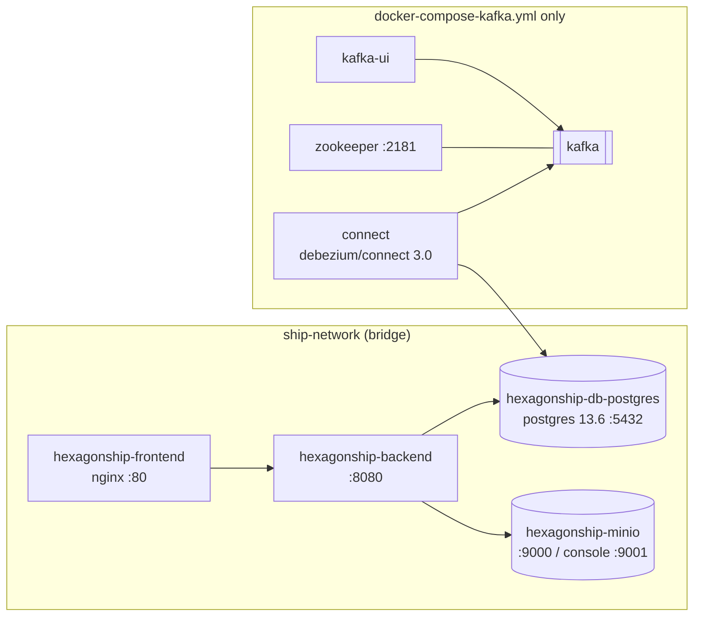

> Status: draft

# 7. Deployment View

Two deployment variants exist, both container-based. Kafka and Debezium exist **only** in the
Compose variant.

## 7.1 Docker Compose (local / try-it-out)

| File | Starts | Use |
|---|---|---|
| `docker-compose.yml` | frontend, backend, Postgres, MinIO | App only, no event publication. |
| `docker-compose-app.yml` | the same, alternative volumes / bitnami MinIO | App variant. |
| `docker-compose-kafka.yml` | the app plus Zookeeper, Kafka, Kafka Connect (Debezium), Kafka UI | Full system incl. outbox → Kafka. Connectors are registered by hand from `kafka-connect/connectors/`. |

`ship-terminal` is not containerised; it is run locally and connects to `localhost:9094`.

## 7.2 Kubernetes (`k8s/`, namespace `ddd-ship`)

| Manifest | Workload | Notes |
|---|---|---|
| `00-namespace.yml` | Namespace `ddd-ship` | |
| `10-secrets.yaml` | Secrets `postgres-credentials`, `minio-credentials` | Committed to the repo. |
| `11-configmaps.yaml` | ConfigMap `backend-config` | Backend environment. |
| `20-postgres.yaml` | StatefulSet, 1 replica, postgres 13.6 | |
| `21-minio.yaml` | StatefulSet, 1 replica + Job (`minio/mc`) seeding the Catain Images | |
| `30-backend.yaml` | Deployment, 2 replicas, `moonrider100/hexagonship-backend:latest` | Startup/readiness/liveness probes on `/actuator/health/*`. |
| `40-frontend.yaml` | Deployment, 2 replicas, `ddd-ship-frontend:latest` (`IfNotPresent`) | Image must exist locally on the node; not pushed by CI. |
| `50-ingress.yaml` | Ingress (class `nginx`) | `/web` → backend :8080, `/` → frontend :80. |

Cluster setup notes: `k8s/cluster-setup.txt`.

## 7.3 Build pipeline

GitHub Actions (`.github/workflows/docker-image.yml`) builds the **backend** image on every push to
`main` (multi-arch amd64/arm64) and pushes it to Docker Hub as `:latest`. The frontend image is built
locally (`ship-frontend/Dockerfile`). Dependabot is configured (`.github/dependabot.yml`).
