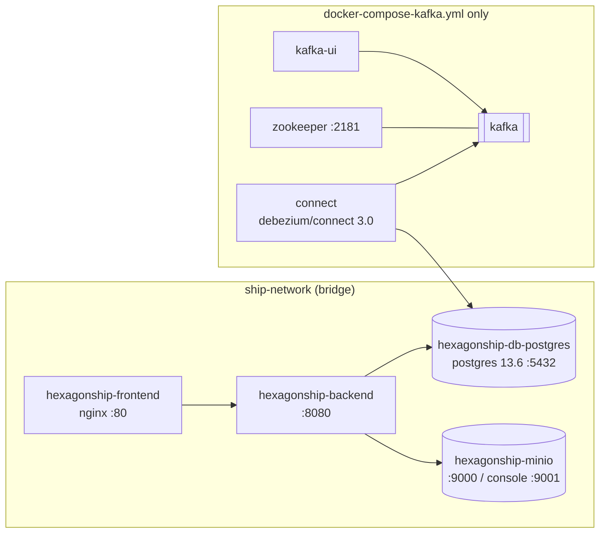

> Status: draft

# 7. Deployment View

Two deployment variants exist, both container-based. Kafka and Debezium exist **only** in the
Compose variant.

## 7.1 Docker Compose (local / try-it-out)

| File | Starts | Use |
|---|---|---|
| `docker-compose.yml` | frontend, backend, Postgres, MinIO | App only, no event publication. |
| `docker-compose-app.yml` | the same, alternative volumes / bitnami MinIO | App variant. |
| `docker-compose-harbor.yml` | frontend, backend, Postgres, MinIO for one Harbor, parameterised by `harbors/<slug>.env` | One Compose project per Harbor; needs Kafka running (7.4). |
| `docker-compose-kafka.yml` | the app plus Zookeeper, Kafka, Kafka Connect (Debezium), Kafka UI | Full system incl. outbox → Kafka. Connectors are registered by hand from `kafka-connect/connectors/`. |

The frontend's nginx proxies `/web` to the backend. The fleet-events stream (`/web/fleet-events`,
[ADR-0006](../adr/0006-push-fleet-changes-to-the-frontend-with-server-sent-events.md)) has its own
`location` with buffering off, HTTP/1.1 without `Connection: close`, and a 1 h read timeout, so events
pass through at once and idle streams survive between heartbeats.

`ship-terminal` is not containerised; it is run locally and connects to `localhost:9094`.

## 7.2 Kubernetes (`k8s/`, namespace `ddd-ship`)

| Manifest | Workload | Notes |
|---|---|---|
| `00-namespace.yml` | Namespace `ddd-ship` | |
| `10-secrets.yaml` | Secrets `postgres-credentials`, `minio-credentials` | Committed to the repo. |
| `11-configmaps.yaml` | ConfigMap `backend-config` | Backend environment. |
| `20-postgres.yaml` | StatefulSet, 1 replica, postgres 13.6 | |
| `21-minio.yaml` | StatefulSet, 1 replica + Job (`minio/mc`) seeding the Catain Images | |
| `30-backend.yaml` | Deployment, 2 replicas, `moonrider100/hexagonship-backend:latest` | Startup/readiness/liveness probes on `/actuator/health/*`. |
| `40-frontend.yaml` | Deployment, 2 replicas, `ddd-ship-frontend:latest` (`IfNotPresent`) | Image must exist locally on the node; not pushed by CI. |
| `50-ingress.yaml` | Two Ingresses (class `nginx`) | `ddd-ship-ingress`: `/web` → backend :8080, `/` → frontend :80. `ddd-ship-fleet-events-ingress`: exactly `/web/fleet-events` → backend :8080, with proxy buffering off and 1 h read/send timeouts (annotations apply per Ingress object). |

Cluster setup notes: `k8s/cluster-setup.txt`.

## 7.4 Several Harbors

Per [ADR-0003](../adr/0003-run-each-ship-backend-instance-as-one-harbor.md), a second Harbor is a
second copy of the app stack (frontend, backend, PostgreSQL, MinIO) with its own Harbor Name, sharing
one Kafka and Kafka Connect.

**Compose (built):** one Compose project per Harbor, from the single parameterised
`docker-compose-harbor.yml`, started as
`docker compose -p <slug> --env-file harbors/<slug>.env -f docker-compose-harbor.yml up -d`. The env
file sets the Harbor Name, slug and host ports; container names and volumes are prefixed with the
slug, and each project has its own default network. Only backend and PostgreSQL join the shared
`my_kafka_network`. A third Harbor is one more env file and one more connector. Steps:
[how-to-run-two-harbors](../services/ship-backend/how-to-run-two-harbors.md).

- one Debezium outbox connector per Harbor in `kafka-connect/connectors/shipping-outbox-<slug>.json`, with its own connector name, `database.hostname` and replication slot;
- the topic `hexagonship-harbor` created with `cleanup.policy=compact` before the first Harbor starts, by `kafka-connect/connect-helpers/create-harbor-topic` ([ADR-0005](../adr/0005-discover-harbors-via-harbor-opened-events-on-a-compacted-topic.md));
- Kafka reachable from every backend ([ADR-0004](../adr/0004-consume-kafka-events-in-ship-backend-through-an-idempotent-inbox.md)).

**Kubernetes (planned):** one namespace per Harbor. This requires Kafka in the cluster first (R-4).

## 7.3 Build pipeline

GitHub Actions (`.github/workflows/docker-image.yml`) builds the **backend** image on every push to
`main` (multi-arch amd64/arm64) and pushes it to Docker Hub as `:latest`. The frontend image is built
locally (`ship-frontend/Dockerfile`). Dependabot is configured (`.github/dependabot.yml`).
