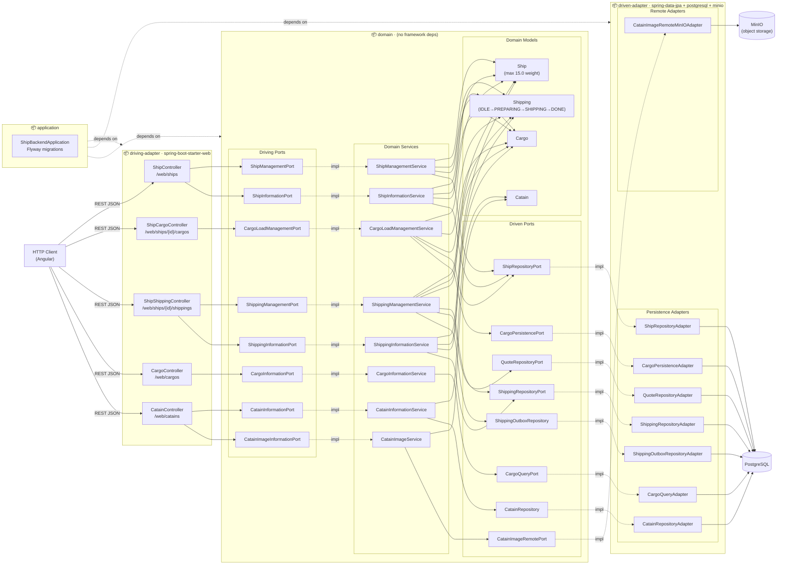
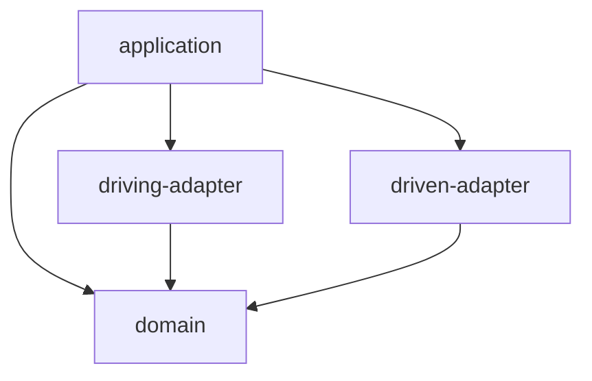

# Ship Backend Architecture

```mermaid
flowchart LR
    HTTP["HTTP Client\n(Angular)"]

    subgraph APP["📦 application"]
        MAIN["ShipBackendApplication\nFlyway migrations"]
    end

    subgraph DRIVING["📦 driving-adapter · spring-boot-starter-web"]
        SC["ShipController\n/web/ships"]
        SCC["ShipCargoController\n/web/ships/{id}/cargos"]
        SSC["ShipShippingController\n/web/ships/{id}/shippings"]
        CC["CargoController\n/web/cargos"]
        CAC["CatainController\n/web/catains"]
    end

    subgraph DOMAIN["📦 domain · (no framework deps)"]
        subgraph DP_IN["Driving Ports"]
            SMP["ShipManagementPort"]
            SIP["ShipInformationPort"]
            SHMP["ShippingManagementPort"]
            SHIP_IP["ShippingInformationPort"]
            CIP["CargoInformationPort"]
            CLMP["CargoLoadManagementPort"]
            CAIP["CatainInformationPort"]
            CAIIP["CatainImageInformationPort"]
        end

        subgraph SVC["Domain Services"]
            SMS["ShipManagementService"]
            SIS["ShipInformationService"]
            SHMS["ShippingManagementService"]
            SHIS["ShippingInformationService"]
            CIS["CargoInformationService"]
            CLMS["CargoLoadManagementService"]
            CAIS["CatainInformationService"]
            CAIIS["CatainImageService"]
        end

        subgraph MDL["Domain Models"]
            SHIP_M["Ship\n(max 15.0 weight)"]
            SHIPPING_M["Shipping\n(IDLE→PREPARING→SHIPPING→DONE)"]
            CARGO_M["Cargo"]
            CATAIN_M["Catain"]
        end

        subgraph DP_OUT["Driven Ports"]
            SHRP["ShipRepositoryPort"]
            SHRPP["ShippingRepositoryPort"]
            CPP["CargoPersistencePort"]
            CQP["CargoQueryPort"]
            CR["CatainRepository"]
            QRP["QuoteRepositoryPort"]
            SOR["ShippingOutboxRepository"]
            CAIRP["CatainImageRemotePort"]
        end
    end

    subgraph DRIVEN["📦 driven-adapter · spring-data-jpa + postgresql + minio"]
        subgraph JPA["Persistence Adapters"]
            SRA["ShipRepositoryAdapter"]
            SHPRA["ShippingRepositoryAdapter"]
            CPA["CargoPersistenceAdapter"]
            CQRA["CargoQueryAdapter"]
            CATRA["CatainRepositoryAdapter"]
            QRA["QuoteRepositoryAdapter"]
            SORA["ShippingOutboxRepositoryAdapter"]
        end
        subgraph REMOTE["Remote Adapters"]
            CAIMA["CatainImageRemoteMinIOAdapter"]
        end
    end

    PG[("PostgreSQL")]
    MINIO[("MinIO\n(object storage)")]

    %% External → Driving
    HTTP -->|REST JSON| SC & SCC & SSC & CC & CAC

    %% Driving → Driving Ports
    SC --> SMP & SIP
    SCC --> CLMP
    SSC --> SHMP & SHIP_IP
    CC --> CIP
    CAC --> CAIP & CAIIP

    %% Driving Ports → Services (implements)
    SMP -.->|impl| SMS
    SIP -.->|impl| SIS
    SHMP -.->|impl| SHMS
    SHIP_IP -.->|impl| SHIS
    CIP -.->|impl| CIS
    CLMP -.->|impl| CLMS
    CAIP -.->|impl| CAIS
    CAIIP -.->|impl| CAIIS

    %% Services → Models
    SMS & SIS & SHMS & SHIS & CLMS --> SHIP_M & SHIPPING_M & CARGO_M
    CAIS & CAIIS --> CATAIN_M

    %% Services → Driven Ports
    SMS --> SHRP
    SIS --> SHRP
    SHMS --> SHRPP & QRP & SOR
    SHIS --> SHRPP
    CIS --> CQP
    CLMS --> SHRP & CPP
    CAIS --> CR
    CAIIS --> CAIRP

    %% Driven Ports → Adapters (implements)
    SHRP -.->|impl| SRA
    SHRPP -.->|impl| SHPRA
    CPP -.->|impl| CPA
    CQP -.->|impl| CQRA
    CR -.->|impl| CATRA
    QRP -.->|impl| QRA
    SOR -.->|impl| SORA
    CAIRP -.->|impl| CAIMA

    %% Adapters → Infra
    SRA & SHPRA & CPA & CQRA & CATRA & QRA & SORA --> PG
    CAIMA --> MINIO

    %% Module deps (application wires everything)
    APP -.->|depends on| DRIVING & DRIVEN & DOMAIN
```

## Module dependency graph

```mermaid
graph TD
    APP["application"]
    DRV["driving-adapter"]
    DRN["driven-adapter"]
    DOM["domain"]

    APP --> DRV
    APP --> DRN
    APP --> DOM
    DRV --> DOM
    DRN --> DOM
```
